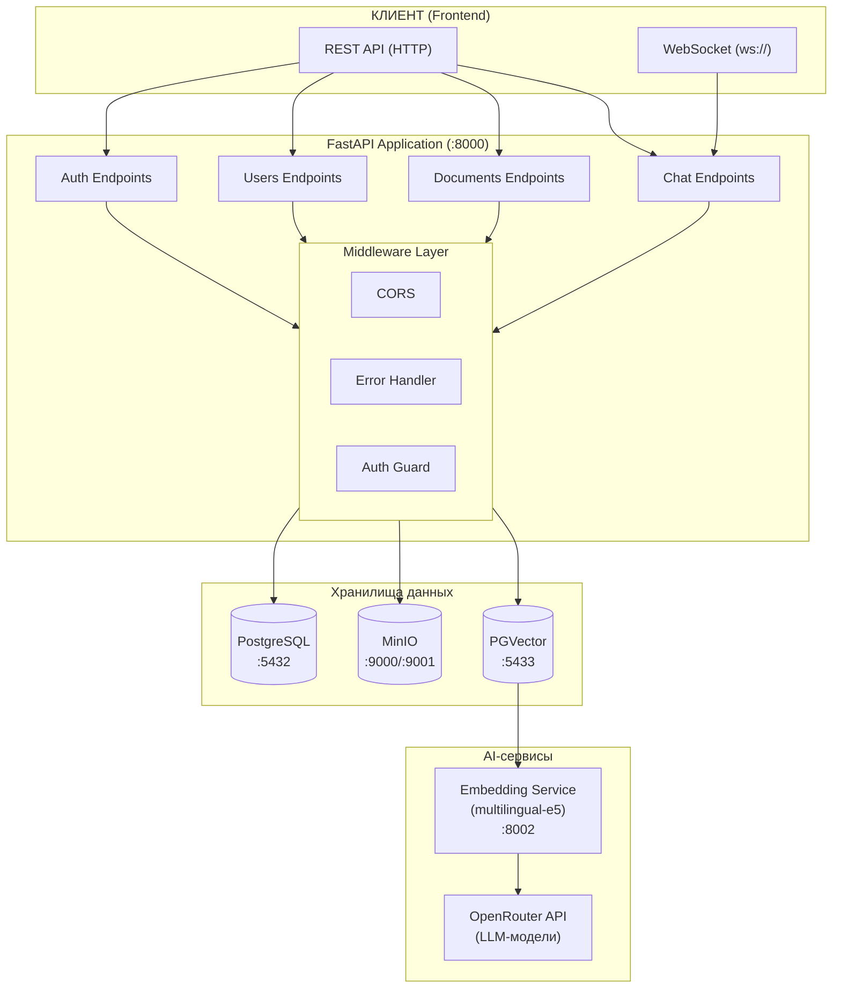
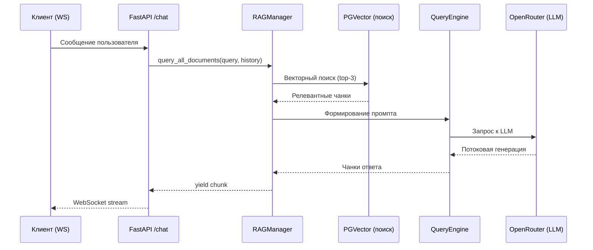
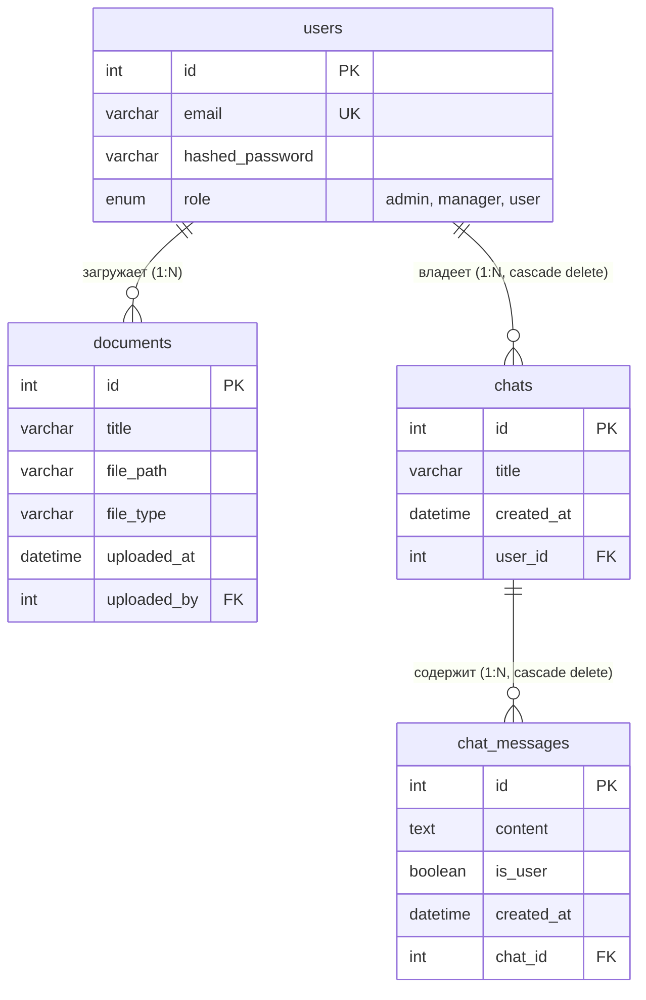
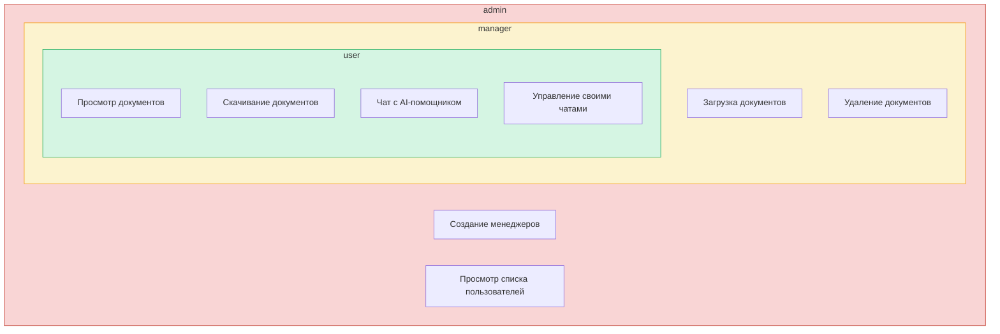
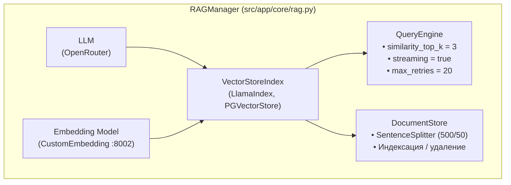
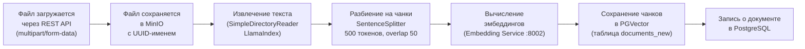
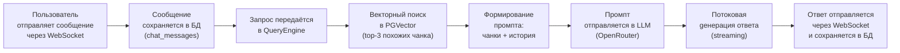
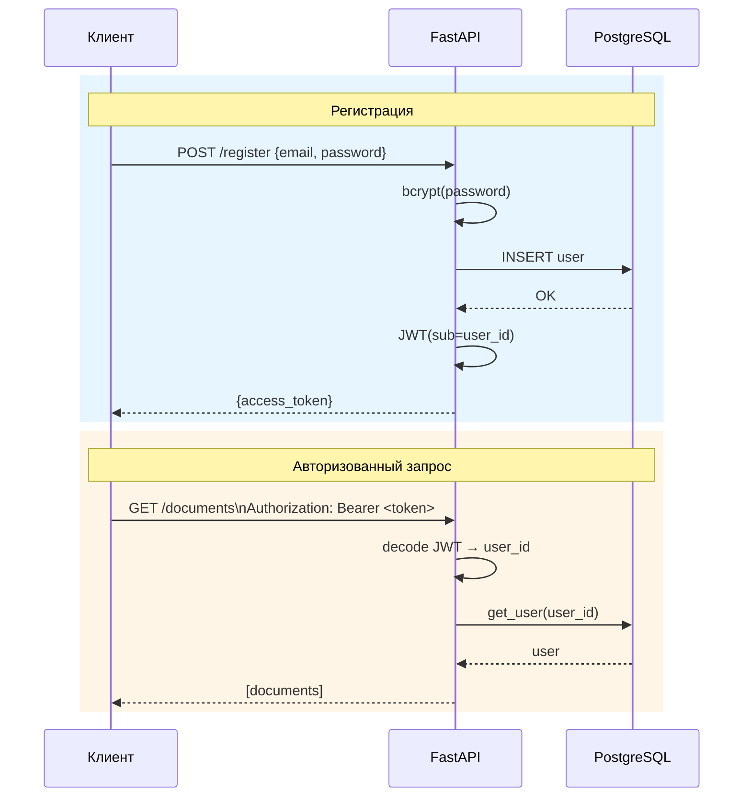
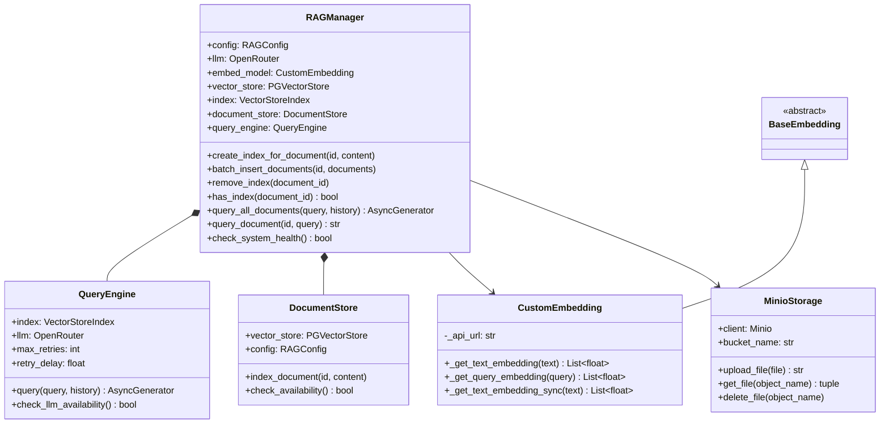
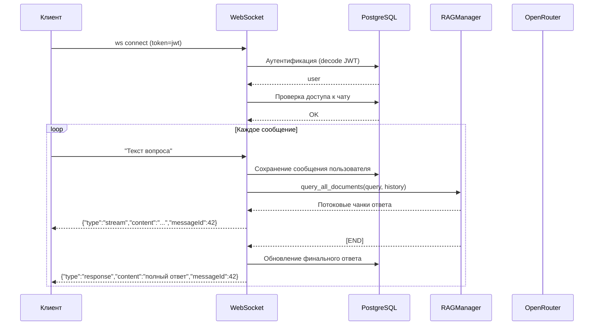

# AI Help Bot Backend

> Дипломная работа — Backend-система интеллектуального помощника по документации с использованием RAG (Retrieval-Augmented Generation)

---

## Содержание

- [Описание проекта](#описание-проекета)
- [Архитектура системы](#архитектура-системы)
- [Технологический стек](#технологический-стек)
- [Структура проекта](#структура-проекта)
- [Модели данных](#модели-данных)
- [API Endpoints](#api-endpoints)
- [RAG-система](#rag-система)
- [Система аутентификации](#система-аутентификации)
- [Установка и запуск](#установка-и-запуск)
- [CLI-утилита](#cli-утилита)
- [Переменные окружения](#переменные-окружения)

---

## Описание проекта

AI Help Bot Backend — это серверная часть интеллектуального помощника, который позволяет загружать документы (PDF, DOCX, RTF, MD) и задавать вопросы по их содержанию. Система использует подход **RAG (Retrieval-Augmented Generation)**: перед генерацией ответа она извлекает релевантные фрагменты из загруженных документов и передаёт их в LLM для формирования точного ответа.

Фронт - https://github.com/rvnzz/aihelpbot_front
Сервер эмбидингов - https://github.com/rvnzz/aihelpbot_embed

### Ключевые возможности

- Загрузка, хранение и скачивание документов
- Автоматическая индексация документов в векторном хранилище
- Интеллектуальный поиск по содержимому документов
- Потоковая генерация ответов через WebSocket
- Ролевая модель доступа (admin / manager / user)
- JWT-аутентификация
- История чатов с привязкой к пользователю

---

## Архитектура системы

### Общая схема



### Диаграмма потоков данных при запросе пользователя



---

## Технологический стек

| Компонент | Технология | Назначение |
|-----------|-----------|------------|
| Web-фреймворк | **FastAPI** 0.115+ | REST API + WebSocket |
| Язык | **Python** 3.12 | Основная разработка |
| ORM | **SQLAlchemy** 2.0+ | Работа с PostgreSQL |
| Основная БД | **PostgreSQL** 16 | Пользователи, документы, чаты |
| Векторная БД | **PGVector** (pg15) | Хранение эмбеддингов |
| Объектное хранилище | **MinIO** | Файлы документов |
| RAG-фреймворк | **LlamaIndex** 0.12+ | Индексация и поиск |
| LLM | **OpenRouter** (DeepSeek-R1-Distill-Llama-8B) | Генерация ответов |
| Эмбеддинги | **multilingual-e5-large-instruct** (GGUF, квантизация Q8) | Векторизация текста |
| Эмбеддинг-сервис | Кастомный Docker-контейнер | API для получения эмбеддингов |
| Аутентификация | **JWT** (python-jose) | Токены доступа |
| Хеширование паролей | **bcrypt** (passlib) | Безопасное хранение паролей |
| Валидация | **Pydantic** 2.10+ | Схемы данных |
| WebSocket | **websockets** 15+ | Потоковый чат |
| Тестирование | **pytest** + pytest-asyncio | Unit/Integration тесты |
| Управление пакетами | **uv** | Зависимости Python |
| Контейнеризация | **Docker** + Docker Compose | Развёртывание |

---

## Структура проекта

```
aihelpbot_backend/
├── src/
│   └── app/
│       ├── main.py                      # Точка входа FastAPI-приложения
│       ├── __init__.py
│       │
│       ├── api/                         # API-слой (контроллеры)
│       │   ├── __init__.py
│       │   └── v1/
│       │       ├── __init__.py
│       │       ├── api.py               # Агрегатор роутеров
│       │       └── endpoints/
│       │           ├── __init__.py
│       │           ├── auth.py          # Аутентификация (login, register, whoami)
│       │           ├── users.py         # Управление пользователями
│       │           ├── documents.py     # CRUD документов
│       │           └── chat.py          # Чат (REST + WebSocket)
│       │
│       ├── core/                        # Ядро бизнес-логики
│       │   ├── __init__.py
│       │   ├── config.py                # Настройки (pydantic-settings)
│       │   ├── database.py              # Подключение к PostgreSQL
│       │   ├── security.py              # JWT-токены, аутентификация
│       │   ├── dependencies.py          # FastAPI Depends (проверка ролей)
│       │   ├── hashing.py               # Хеширование паролей (bcrypt)
│       │   ├── storage.py               # MinIO-клиент (файловое хранилище)
│       │   ├── rag.py                   # RAGManager — главный оркестратор RAG
│       │   ├── query_engine.py          # Движок запросов к LLM с retry
│       │   ├── embeddings.py            # Кастомная модель эмбеддингов
│       │   ├── document_store.py        # Управление векторным хранилищем
│       │   ├── middleware.py            # Middleware обработки ошибок
│       │   ├── exceptions.py            # Кастомные исключения
│       │   └── logger.py                # Настройка логирования
│       │
│       ├── models/                      # SQLAlchemy-модели (таблицы БД)
│       │   ├── __init__.py
│       │   ├── user.py                  # Модель User + UserRole
│       │   ├── document.py              # Модель Document
│       │   └── chat.py                  # Модели Chat + ChatMessage
│       │
│       ├── schemas/                     # Pydantic-схемы (DTO)
│       │   ├── __init__.py
│       │   ├── user.py                  # UserBase, UserCreate, UserUpdate, User
│       │   ├── document.py              # Document, UploadResult, UploadError
│       │   └── chat.py                  # Chat, ChatMessage, ChatBrief, ChatHistory
│       │
│       ├── crud/                        # CRUD-операции (работа с БД)
│       │   ├── __init__.py
│       │   ├── crud_user.py             # Операции с пользователями
│       │   ├── crud_document.py         # Операции с документами + RAG
│       │   └── crud_chat.py             # Операции с чатами
│       │
│       └── cli/                         # CLI-утилита управления
│           ├── __init__.py
│           └── manage.py                # Click-команды (create_user, list_users, etc.)
│
├── docker-compose.yml                   # Оркестрация контейнеров
├── Dockerfile                           # Образ приложения
├── pyproject.toml                       # Конфигурация проекта и зависимости
├── uv.lock                              # Lock-файл зависимостей
├── manage.sh                            # Обёртка для CLI
├── run_tests.py                         # Скрипт запуска тестов
├── .env                                 # Переменные окружения (не в git)
├── .python-version                      # Версия Python: 3.12
└── .gitignore
```

---

## Модели данных

### Диаграмма базы данных



### Описание моделей

#### User (`src/app/models/user.py`)
| Поле | Тип | Описание |
|------|-----|----------|
| `id` | Integer, PK | Уникальный идентификатор |
| `email` | String, unique | Email (используется для входа) |
| `hashed_password` | String | bcrypt-хеш пароля |
| `role` | Enum(UserRole) | Роль: `admin`, `manager`, `user` |

**Связи:** `documents` (1:N), `chats` (1:N, cascade delete)

#### Document (`src/app/models/document.py`)
| Поле | Тип | Описание |
|------|-----|----------|
| `id` | Integer, PK | Уникальный идентификатор |
| `title` | String | Имя файла (с автоматическим переименованием при коллизии) |
| `file_path` | String | Путь в MinIO (UUID-имя) |
| `file_type` | String | Расширение файла (.pdf, .docx, ...) |
| `uploaded_at` | DateTime | Дата загрузки (auto: utcnow) |
| `uploaded_by` | Integer, FK | Ссылка на пользователя |

#### Chat (`src/app/models/chat.py`)
| Поле | Тип | Описание |
|------|-----|----------|
| `id` | Integer, PK | Уникальный идентификатор |
| `title` | String | Название чата |
| `created_at` | DateTime | Дата создания |
| `user_id` | Integer, FK | Владелец чата |

**Связи:** `messages` (1:N, cascade delete)

#### ChatMessage (`src/app/models/chat.py`)
| Поле | Тип | Описание |
|------|-----|----------|
| `id` | Integer, PK | Уникальный идентификатор |
| `content` | Text | Текст сообщения |
| `is_user` | Boolean | `true` — сообщение пользователя, `false` — ответ бота |
| `created_at` | DateTime | Время создания |
| `chat_id` | Integer, FK | Ссылка на чат |

---

## API Endpoints

### Базовый URL: `/api/v1`

### Аутентификация (`/api/v1`)

| Метод | Путь | Описание | Авторизация |
|-------|------|----------|-------------|
| `POST` | `/login` | Получение JWT-токена по email + password | Публичный |
| `POST` | `/register` | Регистрация нового пользователя | Публичный |
| `GET` | `/whoami` | Информация о текущем пользователе | Любая роль |

### Документы (`/api/v1/documents`)

| Метод | Путь | Описание | Авторизация |
|-------|------|----------|-------------|
| `POST` | `/upload` | Загрузка файлов (multipart) | manager, admin |
| `GET` | `/` | Список документов (skip, limit) | Любая роль |
| `GET` | `/download/{id}` | Скачивание файла | Любая роль |
| `DELETE` | `/{id}` | Удаление документа + индекса | manager, admin |

**Поддерживаемые форматы:** `.pdf`, `.doc`, `.docx`, `.rtf`, `.md`

### Пользователи (`/api/v1/users`)

| Метод | Путь | Описание | Авторизация |
|-------|------|----------|-------------|
| `POST` | `/managers` | Создание менеджера | admin |
| `GET` | `/users` | Список всех пользователей | admin |

### Чат (`/api/v1/chat`)

| Метод | Путь | Описание | Авторизация |
|-------|------|----------|-------------|
| `POST` | `/` | Создать новый чат | Любая роль |
| `GET` | `/` | Список чатов пользователя | Любая роль |
| `GET` | `/{id}` | Получить информацию о чате | Владелец |
| `GET` | `/{id}/history` | История сообщений чата | Владелец |
| `PUT` | `/{id}/rename` | Переименовать чат | Владелец |
| `DELETE` | `/{id}` | Удалить чат | Владелец |
| `WS` | `/ws/{id}` | WebSocket для потокового общения | Любая роль (токен в query) |

### Ролевая модель



---

## RAG-система

### Архитектура RAG



### Процесс загрузки документа в RAG



### Процесс ответа на вопрос



### Конфигурация RAG

| Параметр | Значение | Описание |
|----------|---------|----------|
| `chunk_size` | 500 | Размер чанка в токенах |
| `chunk_overlap` | 50 | Перекрытие между чанками |
| `similarity_top_k` | 3 | Количество релевантных чанков |
| `embed_dim` | 1024 | Размерность эмбеддинга |
| `max_retries` | 20 | Максимальное число повторов при ошибке LLM |
| `retry_delay` | 5.0 | Задержка между повторами (сек) |
| `context_window` | 16384 | Размер контекстного окна LLM |
| `max_tokens` | 2048 | Макс. токенов в ответе |
| `temperature` | 0.7 | Температура генерации |

---

## Система аутентификации

### Flow аутентификации



### Компоненты безопасности

| Модуль | Функции |
|--------|---------|
| `core/hashing.py` | `get_password_hash()` — bcrypt-хеш; `verify_password()` — проверка пароля |
| `core/security.py` | `create_access_token()` — создание JWT; `get_current_user()` — извлечение пользователя из токена; `decode_token()` — декодирование JWT |
| `core/dependencies.py` | `get_current_user()` — FastAPI Depends для аутентификации; `check_admin_permission()` — проверка роли admin; `check_manager_permission()` — проверка роли manager/admin; `get_current_user_ws()` — аутентификация WebSocket через query-параметр `?token=` |

### JWT-токен

- **Алгоритм:** HS256
- **Payload:** `{"sub": "<user_id>", "exp": <timestamp>}`
- **Время жизни:** 30 минут (настраивается)
- **WebSocket:** токен передаётся как query-параметр `?token=<jwt>`

---

## Установка и запуск

### Предварительные требования

- Python 3.12+
- Docker & Docker Compose
- uv (менеджер пакетов)

### 1. Клонирование и установка зависимостей

```bash
git clone <repo-url>
cd aihelpbot_backend
uv sync
```

### 2. Настройка переменных окружения

Создайте файл `.env` (или отредактируйте существующий):

```env
POSTGRES_SERVER=localhost
POSTGRES_USER=postgres
POSTGRES_PASSWORD=postgrespass
POSTGRES_DB=doc_management

PGVECTOR_SERVER=localhost
PGVECTOR_PORT=5432
PGVECTOR_USER=pgvector
PGVECTOR_PASSWORD=pgvectorpass
PGVECTOR_DB=vectors

JWT_SECRET_KEY=<ваш_секретный_ключ>
SECRET_KEY=<ваш_секретный_ключ>

MINIO_ROOT_USER=minioadmin
MINIO_ROOT_PASSWORD=minioadmin
MINIO_ENDPOINT=localhost:9000
MINIO_SECURE=False
MINIO_BUCKET_NAME=documents

MODEL_NAME=<модель_openrouter>
API_KEY=<ключ_openrouter>
TEMPERATURE=0.7
MAX_TOKENS=2048

EMBEDDING_BASE_URL=http://localhost:8002
```

### 3. Запуск инфраструктуры (Docker)

```bash
docker-compose up -d
```

Это запустит:
- **PostgreSQL** на порту `5432`
- **PGVector** на порту `5433`
- **MinIO** на портах `9000` (API) и `9001` (Console)
- **Embedding Service** на порту `8002`
- **Adminer** на порту `8080` (веб-интерфейс для БД)

### 4. Запуск приложения

```bash
uvicorn app.main:app --host 0.0.0.0 --port 8000 --reload
```

### 5. Создание администратора

```bash
./manage.sh create-user
# Следуйте интерактивным подсказкам: email, пароль, роль (admin)
```

### 6. Открытие API-документации

После запуска документация Swagger доступна по адресу: `http://localhost:8000/api/v1/openapi.json`

---

## CLI-утилита

Утилита управления на базе `Click` (`src/app/cli/manage.py`):

```bash
./manage.sh <command>
```

| Команда | Описание |
|---------|----------|
| `create-user` | Создать пользователя (интерактивно: email, пароль, роль) |
| `list-users` | Показать всех пользователей |
| `recreate-tables` | Пересоздать все таблицы БД (с подтверждением, удаление данных!) |
| `list-chroma-collections` | Показать коллекции в векторном хранилище |
| `show-collection-content <name>` | Показать содержимое коллекции |

---

## Переменные окружения

| Переменная | По умолчанию | Описание |
|-----------|-------------|----------|
| `PROJECT_NAME` | Document Management API | Название проекта |
| `VERSION` | 1.0.0 | Версия API |
| `API_V1_STR` | /api/v1 | Префикс API |
| `POSTGRES_SERVER` | localhost | Хост PostgreSQL |
| `POSTGRES_USER` | postgres | Пользователь PostgreSQL |
| `POSTGRES_PASSWORD` | postgrespass | Пароль PostgreSQL |
| `POSTGRES_DB` | doc_management | Имя базы данных |
| `PGVECTOR_SERVER` | localhost | Хост PGVector |
| `PGVECTOR_PORT` | 5432 | Порт PGVector |
| `PGVECTOR_USER` | pgvector | Пользователь PGVector |
| `PGVECTOR_PASSWORD` | pgvectorpass | Пароль PGVector |
| `PGVECTOR_DB` | vectors | Имя БД PGVector |
| `JWT_SECRET_KEY` | (обязательно) | Секретный ключ JWT |
| `SECRET_KEY` | (обязательно) | Секретный ключ приложения |
| `ALGORITHM` | HS256 | Алгоритм шифрования JWT |
| `ACCESS_TOKEN_EXPIRE_MINUTES` | 30 | Время жизни токена (мин) |
| `MINIO_ROOT_USER` | (обязательно) | Пользователь MinIO |
| `MINIO_ROOT_PASSWORD` | (обязательно) | Пароль MinIO |
| `MINIO_ENDPOINT` | (обязательно) | Endpoint MinIO (host:port) |
| `MINIO_SECURE` | False | Использовать HTTPS для MinIO |
| `MINIO_BUCKET_NAME` | documents | Имя корзины MinIO |
| `MODEL_NAME` | (обязательно) | Имя LLM-модели |
| `API_KEY` | (обязательно) | API-ключ OpenRouter |
| `TEMPERATURE` | 0.7 | Температура генерации LLM |
| `MAX_TOKENS` | 2048 | Макс. токенов в ответе |
| `STREAM_TOKENS` | True | Потоковая генерация |
| `EMBEDDING_BASE_URL` | (обязательно) | URL сервиса эмбеддингов |

---

## Описание ключевых модулей

### Диаграмма классов архитектуры



### `core/rag.py` — RAGManager

Главный оркестратор RAG-системы. Инициализирует LLM, эмбеддинги, векторное хранилище, индекс и query engine.

| Метод | Описание |
|-------|----------|
| `create_index_for_document(id, content)` | Разбивает текст на чанки, получает эмбеддинги, сохраняет в PGVector |
| `batch_insert_documents(id, documents)` | Пакетная вставка документов с группировкой эмбеддингов |
| `remove_index(document_id)` | Удаление всех векторов документа из хранилища |
| `has_index(document_id)` | Проверка наличия индекса для документа |
| `query_all_documents(query, history)` | Потоковый поиск ответа по всем документам |
| `query_document(id, query)` | Запрос к конкретному документу |
| `check_system_health()` | Проверка доступности LLM и vector store |

### `core/query_engine.py` — QueryEngine

Движок выполнения запросов с механизмом повторных попыток.

| Метод | Описание |
|-------|----------|
| `query(query, history, is_new_dialog)` | Асинхронный потоковый запрос к LLM с retry-логикой |
| `check_llm_availability()` | Проверка доступности OpenRouter API |

### `core/embeddings.py` — CustomEmbedding

Кастомная обёртка над внешним embedding-сервисом, наследуется от `BaseEmbedding` LlamaIndex.

| Метод | Описание |
|-------|----------|
| `_get_text_embedding(text)` | Асинхронное получение эмбеддинга текста |
| `_get_query_embedding(query)` | Асинхронное получение эмбеддинга запроса |
| `_get_text_embedding_sync(text)` | Синхронная версия (через nest_asyncio) |

### `core/storage.py` — MinioStorage

Клиент для работы с MinIO (S3-совместимое объектное хранилище).

| Метод | Описание |
|-------|----------|
| `upload_file(file)` | Загрузка файла, возврат UUID-имени |
| `get_file(object_name)` | Получение файла как BytesIO + размер |
| `delete_file(object_name)` | Удаление файла из хранилища |

### `core/document_store.py` — DocumentStore

Управление узлами в векторном хранилище.

| Метод | Описание |
|-------|----------|
| `index_document(id, content)` | Индексация: разбиение на чанки → создание TextNode → добавление в PGVector |
| `check_availability()` | Проверка соединения с PGVector |

### `crud/crud_document.py` — CRUD документов

| Функция | Описание |
|---------|----------|
| `create_documents(db, files, user_id)` | Загрузка файлов в MinIO, извлечение текста, создание записей в БД, индексация в RAG |
| `delete_document(db, document_id)` | Удаление RAG-индекса, файла из MinIO, записи из БД |
| `get_documents(db, skip, limit)` | Список документов с пагинацией |
| `get_unique_title(db, title)` | Генерация уникального имени при коллизии |

### `crud/crud_chat.py` — CRUD чатов

| Функция | Описание |
|---------|----------|
| `create_chat(db, user_id, title)` | Создание нового чата |
| `get_user_chats(db, user_id)` | Список чатов пользователя |
| `add_message(db, chat_id, content, is_user)` | Добавление сообщения в чат |
| `get_chat_messages(db, chat_id, limit, ascending)` | Получение истории сообщений |
| `rename_chat(db, chat_id, new_title)` | Переименование чата |
| `update_message(db, message_id, content)` | Обновление содержимого сообщения |
| `delete_chat(db, chat_id)` | Удаление чата (каскадно с сообщениями) |

### `crud/crud_user.py` — CRUD пользователей

| Функция | Описание |
|---------|----------|
| `create_user(db, user)` | Создание пользователя с bcrypt-хешем пароля |
| `get_user(db, user_id)` | Получение пользователя по ID |
| `get_user_by_email(db, email)` | Получение пользователя по email |
| `get_users(db, skip, limit)` | Список пользователей с пагинацией |
| `authenticate_user(db, email, password)` | Проверка email + пароль |

---

## WebSocket-протокол чата

### Подключение

```
ws://localhost:8000/api/v1/chat/ws/{chat_id}?token=<jwt>
```

### Диаграмма взаимодействия



### Формат сообщений

**Клиент → Сервер:**
```json
"Текст вопроса"
```

**Сервер → Клиент (потоковый ответ):**
```json
{
  "type": "stream",
  "content": "фрагмент ответа...",
  "messageId": 42
}
```

**Сервер → Клиент (финальный ответ):**
```json
{
  "type": "response",
  "content": "полный ответ",
  "messageId": 42
}
```

**Сервер → Клиент (ошибка):**
```json
{
  "type": "error",
  "content": "описание ошибки"
}
```
