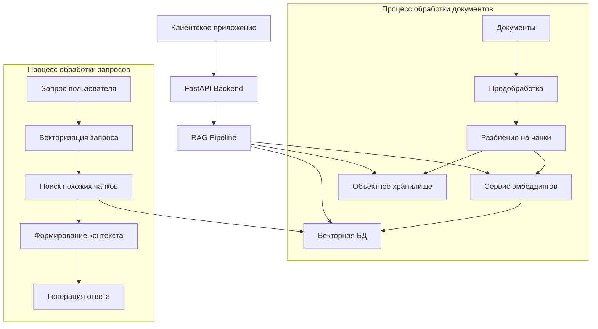

# Архитектура системы AIHelpBot

## Общее описание

AIHelpBot представляет собой интеллектуальную систему поддержки пользователей, построенную на основе архитектуры RAG (Retrieval-Augmented Generation). Система предназначена для обработки и анализа документов, а также предоставления релевантных ответов на запросы пользователей с использованием контекстной информации из обработанных документов.

## Архитектурная диаграмма

## Основные компоненты системы

### Сервис эмбеддингов

Сервис эмбеддингов представляет собой отдельный микросервис, основанный на модели multilingual-e5-large-instruct. Этот сервис отвечает за преобразование текстовых данных в векторные представления, что является ключевым этапом в процессе RAG. Модель поддерживает многоязычность и оптимизирована для работы с инструкциями, что делает её идеальной для обработки различных типов документов и запросов.

### Объектное хранилище (MinIO)

MinIO используется как надежное хранилище для исходных документов и их чанков. Это обеспечивает:
- Масштабируемость хранения
- Высокую доступность данных
- Возможность параллельной обработки
- Эффективное управление большими объемами данных

### Векторная база данных

Векторная база данных хранит эмбеддинги документов и обеспечивает быстрый поиск похожих векторов. Это позволяет системе эффективно находить релевантные фрагменты текста для каждого запроса пользователя.

## Процесс обработки информации

### Этап 1: Подготовка документов

При загрузке нового документа система выполняет следующие шаги:
1. Предварительная обработка текста (очистка, нормализация)
2. Разбиение на логические чанки с учетом контекста
3. Сохранение чанков в MinIO
4. Генерация векторных представлений для каждого чанка
5. Сохранение векторов в векторной базе данных

### Этап 2: Обработка запросов

При получении запроса от пользователя:
1. Генерируется векторное представление запроса
2. Выполняется поиск наиболее релевантных чанков
3. Формируется контекст из найденных чанков
4. Генерируется ответ с учетом контекста

## Масштабируемость и надежность

Система спроектирована с учетом необходимости масштабирования:
- Микросервисная архитектура позволяет независимо масштабировать компоненты
- Контейнеризация обеспечивает изоляцию и простоту развертывания
- Распределенное хранение данных повышает надежность
- Асинхронная обработка запросов обеспечивает высокую производительность

## Безопасность

В системе реализованы следующие механизмы безопасности:
- Аутентификация и авторизация пользователей
- Шифрование данных при передаче
- Изолированные контейнеры для каждого компонента
- Безопасное хранение конфиденциальных данных 