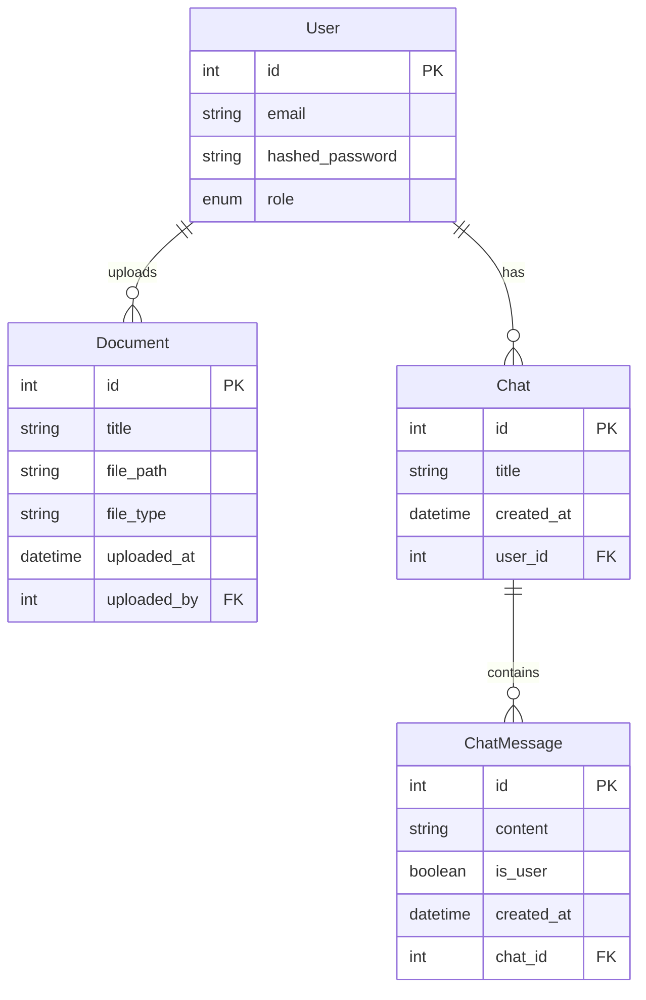

# Схема базы данных

## Таблица User
Таблица для хранения информации о пользователях системы. Содержит основные данные для аутентификации и авторизации пользователей.

| Название | Тип значения | Default |
|----------|--------------|---------|
| id | Integer (int) | - |
| email | String (varchar) | - |
| hashed_password | String (varchar) | - |
| role | Enum (USER, ADMIN) | USER |

## Таблица Document
Таблица для хранения информации о загруженных документах. Используется для управления файлами, которые пользователи загружают в систему для последующего анализа.

| Название | Тип значения | Default |
|----------|--------------|---------|
| id | Integer (int) | - |
| title | String (varchar) | - |
| file_path | String (varchar) | - |
| file_type | String (varchar) | - |
| uploaded_at | DateTime (timestamp) | - |
| uploaded_by | Integer (int) | - |

## Таблица Chat
Таблица для хранения информации о чатах пользователей. Каждый чат представляет собой отдельный диалог пользователя с системой.

| Название | Тип значения | Default |
|----------|--------------|---------|
| id | Integer (int) | - |
| title | String (varchar) | - |
| created_at | DateTime (timestamp) | - |
| user_id | Integer (int) | - |

## Таблица ChatMessage
Таблица для хранения сообщений в чатах. Содержит все сообщения пользователей и ответы системы в рамках каждого чата.

| Название | Тип значения | Default |
|----------|--------------|---------|
| id | Integer (int) | - |
| content | String (text) | - |
| is_user | Boolean (bool) | True |
| created_at | DateTime (timestamp) | - |
| chat_id | Integer (int) | - |

## ER диаграмма

