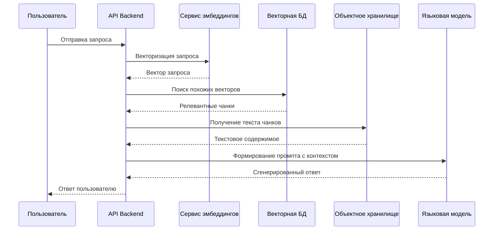
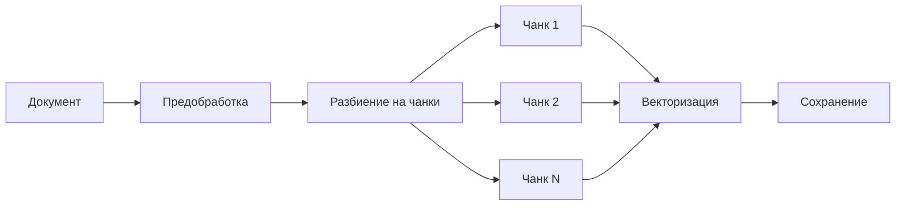

# Процесс RAG в AIHelpBot

## Общее описание процесса RAG

RAG (Retrieval-Augmented Generation) представляет собой современный подход к генерации текста, который сочетает в себе возможности языковых моделей с возможностью поиска релевантной информации в базе знаний. В AIHelpBot этот процесс реализован следующим образом:

## Этапы обработки документов

### 1. Предварительная обработка

При загрузке нового документа система выполняет комплексную предварительную обработку:

1. **Очистка текста**:
   - Удаление специальных символов
   - Нормализация пробелов
   - Обработка форматирования

2. **Структурирование**:
   - Определение заголовков
   - Выделение параграфов
   - Сохранение иерархии документа

### 2. Разбиение на чанки

Процесс разбиения документа на чанки является критически важным для эффективной работы RAG:

#### Стратегия чанкинга

- **Размер чанка**: Оптимизирован для баланса между контекстом и точностью
- **Перекрытие**: Реализовано для сохранения контекста между чанками
- **Семантическая целостность**: Чанки разбиваются с учетом логической структуры текста

### 3. Векторизация

Процесс векторизации выполняется с использованием специализированного сервиса эмбеддингов:

1. **Подготовка текста**:
   - Токенизация
   - Нормализация
   - Обработка специальных случаев

2. **Генерация векторов**:
   - Использование модели multilingual-e5-large-instruct
   - Оптимизация для многоязычности
   - Сохранение семантической информации

### 4. Хранение и индексация

Система использует комбинированный подход к хранению:

1. **MinIO**:
   - Хранение исходных документов
   - Хранение обработанных чанков
   - Управление метаданными

2. **Векторная БД**:
   - Хранение векторных представлений
   - Индексация для быстрого поиска
   - Управление связями между векторами

## Процесс обработки запросов

### 1. Анализ запроса

При получении запроса система выполняет:

1. **Предварительная обработка**:
   - Очистка и нормализация
   - Определение языка
   - Выделение ключевых элементов

2. **Векторизация**:
   - Генерация векторного представления
   - Оптимизация для поиска

### 2. Поиск релевантной информации

Процесс поиска включает:

1. **Поиск похожих векторов**:
   - Использование косинусного сходства
   - Учет контекста
   - Ранжирование результатов

2. **Формирование контекста**:
   - Объединение релевантных чанков
   - Устранение дубликатов
   - Оптимизация размера контекста

### 3. Генерация ответа

Финальный этап включает:

1. **Подготовка промпта**:
   - Формирование структуры
   - Включение контекста
   - Добавление инструкций

2. **Генерация**:
   - Использование языковой модели
   - Контроль качества
   - Форматирование ответа

## Оптимизация и улучшения

Система постоянно оптимизируется для улучшения качества ответов:

1. **Качество чанкинга**:
   - Адаптивный размер чанков
   - Улучшенное определение границ
   - Сохранение контекста

2. **Поиск**:
   - Гибридный поиск
   - Учет релевантности
   - Кэширование результатов

3. **Генерация**:
   - Оптимизация промптов
   - Контроль качества
   - Обратная связь 