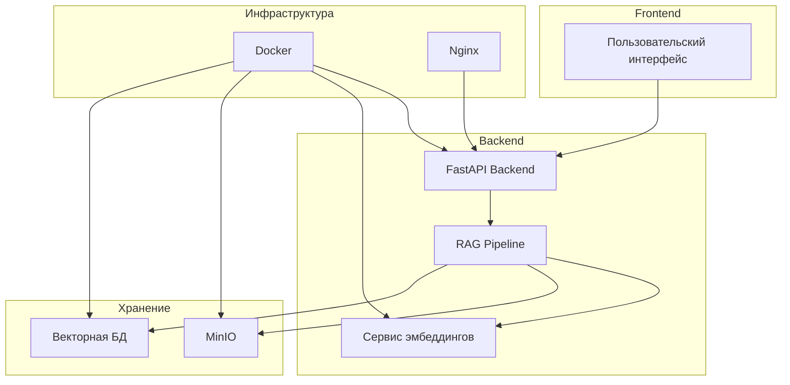

# Техническая реализация AIHelpBot

## Технологический стек



## Компоненты системы

### 1. Backend (FastAPI)

Backend реализован на FastAPI и предоставляет REST API для взаимодействия с системой. Основные эндпоинты:

- `/api/v1/documents` - управление документами
- `/api/v1/chat` - обработка запросов
- `/api/v1/embeddings` - работа с эмбеддингами

### 2. Сервис эмбеддингов

Сервис эмбеддингов реализован как отдельный микросервис с использованием модели multilingual-e5-large-instruct. Основные характеристики:

- Оптимизированная для многоязычности
- Поддержка различных форматов ввода
- Кэширование результатов
- Асинхронная обработка

### 3. Хранилище данных

#### MinIO

MinIO используется для хранения документов и их чанков. Конфигурация:

```yaml
minio:
  endpoint: minio:9000
  access_key: minioadmin
  secret_key: minioadmin
  bucket: documents
  secure: false
```

#### Векторная база данных

Векторная БД хранит эмбеддинги и обеспечивает быстрый поиск. Используется pgvector с оптимизированными индексами.

## Процесс развертывания

### 1. Подготовка окружения

```bash
# Создание виртуального окружения
python -m venv .venv
source .venv/bin/activate

# Установка зависимостей
pip install -r requirements.txt
```

### 2. Конфигурация

Основные настройки системы хранятся в `.env`:

```env
POSTGRES_SERVER=db
POSTGRES_USER=postgres
POSTGRES_PASSWORD=postgres
POSTGRES_DB=doc_management
JWT_SECRET_KEY=your_secret_key
MINIO_ROOT_USER=minioadmin
MINIO_ROOT_PASSWORD=minioadmin
```

### 3. Запуск системы

```bash
# Запуск через Docker Compose
docker-compose up -d

# Проверка статуса
docker-compose ps
```

## Оптимизация производительности

### 1. Кэширование

- Redis для кэширования частых запросов
- Кэширование эмбеддингов
- Кэширование результатов поиска

### 2. Асинхронная обработка

- Асинхронные эндпоинты FastAPI
- Асинхронная обработка документов
- Параллельная векторизация

### 3. Масштабирование

- Горизонтальное масштабирование сервисов
- Балансировка нагрузки
- Репликация данных

## Мониторинг и логирование

### 1. Логирование

- Структурированные логи
- Ротация логов
- Централизованный сбор

### 2. Метрики

- Prometheus для сбора метрик
- Grafana для визуализации
- Алерты на основе метрик

## Безопасность

### 1. Аутентификация

- JWT токены
- OAuth2 интеграция
- Ролевой доступ

### 2. Шифрование

- TLS для API
- Шифрование данных в хранилище
- Безопасное хранение секретов

## Тестирование

### 1. Unit тесты

```python
def test_embedding_service():
    service = EmbeddingService()
    result = service.generate_embedding("test text")
    assert len(result) == 768
```

### 2. Интеграционные тесты

```python
def test_rag_pipeline():
    pipeline = RAGPipeline()
    result = pipeline.process_query("test query")
    assert result is not None
```

### 3. Нагрузочное тестирование

- Locust для тестирования нагрузки
- JMeter для комплексного тестирования
- Мониторинг производительности

## Дальнейшее развитие

### 1. Планируемые улучшения

- Улучшение качества чанкинга
- Оптимизация поиска
- Расширение функциональности

### 2. Исследования

- Эксперименты с новыми моделями
- Улучшение качества ответов
- Оптимизация производительности 